<div align="center">
  <h1>🥋 MartialHub</h1>
  <p><strong>Professional MMA Events & Rankings Management Platform</strong></p>
  
  <p>
    <a href="#-features">Features</a> •
    <a href="#️-architecture">Architecture</a> •
    <a href="#-database-erd">Database ERD</a> •
    <a href="#-screenshots">Screenshots</a> •
    <a href="#-getting-started">Getting Started</a> •
    <a href="#-demo-accounts-seeded-data">Demo Accounts</a> •
    <a href="#-testing">Testing</a> •
    <a href="#-implementation-checklist">Checklist</a> •
    <a href="#-php-security-bingo-checklist">Security Bingo</a>
  </p>

  
  
  
  
  
</div>

---

## 📖 About The Project

**MartialHub** is a comprehensive web-based management system designed for martial arts organizations, event organizers and fighters. Developed **without external frameworks**, the application strictly implements the **MVC architecture** and **Repository Pattern** to ensure code maintainability, scalability and separation of concerns.

The platform manages the complete lifecycle of martial arts events—from creation and participant registration to automated ranking calculations based on fight results. With dynamic discipline support (MMA, K1, BJJ, Boxing and others), MartialHub automatically adapts to new types of martial arts added by organizers, providing a robust solution for tracking fighter statistics, club performance and organizing competitions.

### 🎯 Key Highlights

- **🎪 Event Management** - Create, manage and track MMA events with participant registration limits
- **🥊 Fighter Profiles** - Detailed fighter statistics based on discipline and participated events
- **👥 Multi-Role System** - User, Organizer and Admin roles with fine-grained permissions
- **📊 Advanced Rankings** - Real-time, cross-discipline ranking calculations using PostgreSQL Views and Triggers
- **🔒 Solid Security** - Protection against CSRF, SQL Injection (via PDO) and secure session management
- **🐳 Docker Ready** - Containerized PHP-FPM, Nginx and PostgreSQL for consistent deployment
- **✅ Fully Tested** - Automated unit testing with PHPUnit and endpoint validation via Integration Scripts

---

## ✨ Features

### 🎪 Event Management
- **Browse Events** - View upcoming, past and all martial arts events
- **Event Details** - Complete information with date, location, discipline and registration status
- **Event Registration** - Users can register for events (capacity-limited)
- **Event Search & Filter** - Filter by discipline, location, date and status
- **Featured Events** - One primary, highlighted event showcased on the homepage

### 🥊 Fighter Profiles & Statistics
- **User Profiles** - Personal information and club affiliation
- **Fight History** - Complete record of all personal matches including results and finish methods
- **Statistics by Discipline** - Wins, losses, draws tracked per discipline (MMA, BJJ, BOXING, K1)
- **Performance Tracking** - Detailed view of past performances and individual fight statistics
- **Club Membership** - Affiliation with martial arts clubs

### 👥 User Roles & Permissions
- **User Role** - View events, register for competitions and track personal fight statistics
- **Organizer Role** - Specialized role providing organization identity for events, including all user privileges
- **Admin Role** - Full system access, including user management and role assignment
- **Runtime Verification** - Strict server-side permission checks performed on every system action

### 📊 Rankings System
- **Athlete Rankings** - Automated individual ranking system (Win = 3pts, Draw = 1pt, Loss = 0pt)
- **Multi-Discipline** - Separate, independent rankings for every discipline in the system
- **Club Rankings** - Team-based leaderboards showing total wins and accumulated points
- **Individual Rankings** - High-level overview of personal standing within the rankings
- **Real-time Updates** - Instant updates via PostgreSQL triggers when fight results are entered

### 🗄️ Advanced Database Features
- **4 Database Views**:
  - `v_user_fights` - Detailed fight history with opponent info
  - `v_athlete_records` - Automatic win/loss/draw counting per discipline
  - `v_rankings` - Global athlete rankings with point calculation
  - `v_club_rankings` - Club-based team rankings
- **Automated Trigger** - Mirror fight records (when Fighter A beats Fighter B, both records are created)
- **Complex JOINs** - Multi-table queries for comprehensive data retrieval
- **ACID Transactions** - Data integrity with proper isolation levels (User registration, profile updates and event registration)
- **Relation Types**:
  - One-to-One: `users` ↔ `user_details`
  - One-to-Many: `clubs` → `user_details`, `users` → `events`
  - Many-to-Many: `users` ↔ `events` (via `event_registrations`), `users` ↔ `fights`

### 🔐 Security First
- **CSRF Protection** - Token-based validation on all forms
- **Secure Authentication** - Bcrypt password hashing
- **Session Management** - Secure session handling with timeout
- **Role-Based Access** - Fine-grained permission system
- **SQL Injection Prevention** - Prepared statements throughout
- **XSS Protection** - Proper output escaping

### 🎨 Modern User Experience
- **Responsive Design** - Mobile, tablet and desktop optimized
- **CSS Media Queries** - Adaptive layouts for all screen sizes
- **Intuitive Navigation** - Clean, user-friendly interface
- **Custom Error Pages** - Branded 400, 403, 404, 500 pages
- **Fast Performance** - Optimized assets and efficient database queries using PostgreSQL views

---

## 🛠️ Tech Stack

### Backend
- **PHP 8.3** - Modern PHP with strict typing, OOP and PDO
- **Custom MVC Framework** - Built from scratch following SOLID principles
- **PostgreSQL 17** -  Relational database with views, triggers and functions
- **Nginx** - High-performance web server
- **Composer** - Dependency management

### Frontend
- **Vanilla JavaScript** - Pure JS with Fetch API, no framework dependencies
- **HTML5** - Semantic markup ensuring structure, accessibility and SEO
- **CSS3** - Modern styling with Custom Properties and Media Queries for a mobile-first approach
- **Responsive Web Design** - Fully adaptive layouts optimized for mobile, tablet and desktop devices

### DevOps & Testing
- **Docker & Docker Compose** - Full containerization of the web server, database and PHP environment
- **PHPUnit 10** - Automated unit testing for repositories and core business logic, **fully integrated into the Docker environment**
- **Integration Tests** - Custom Bash/PowerShell scripts for automated endpoint validation and security checks
- **Git** - Version control with systematic commits

### Development Tools
- **pgAdmin** - Database administration interface
- **Composer Autoloader** - PSR-4 autoloading
- **Docker Multi-stage Builds** - Optimized container images for reduced size and improved build performance

---

## 🏗️ Architecture

### Application Architecture

The application follows the **MVC (Model-View-Controller)** pattern with a clear separation between frontend and backend:

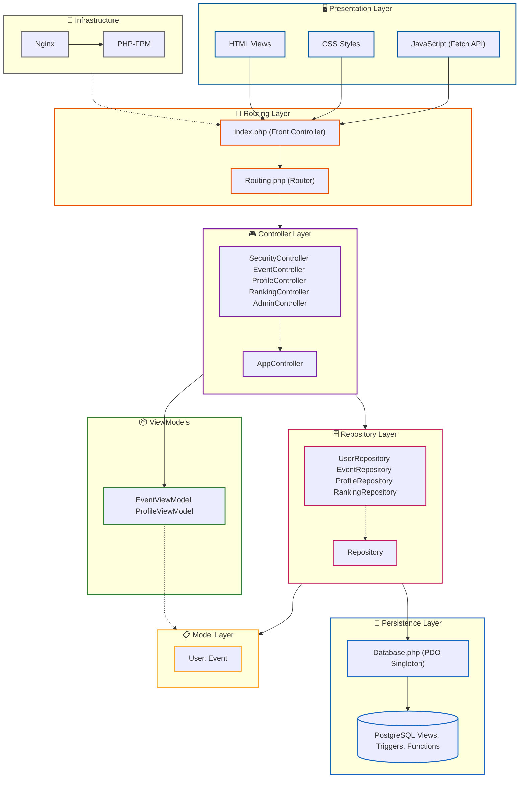

### Key Design Patterns

- **MVC Pattern** - Separates business logic from views for cleaner code
- **Repository Pattern** - Abstracts database operations from the controllers
- **Front Controller** - Single entry point (index.php) for consistent request handling
- **Dependency Injection** - Decouples components for easier maintenance and testing
- **Singleton Pattern** - Ensures a single shared PDO connection to the database

---

## 📊 Database ERD

### Entity Relationship Diagram

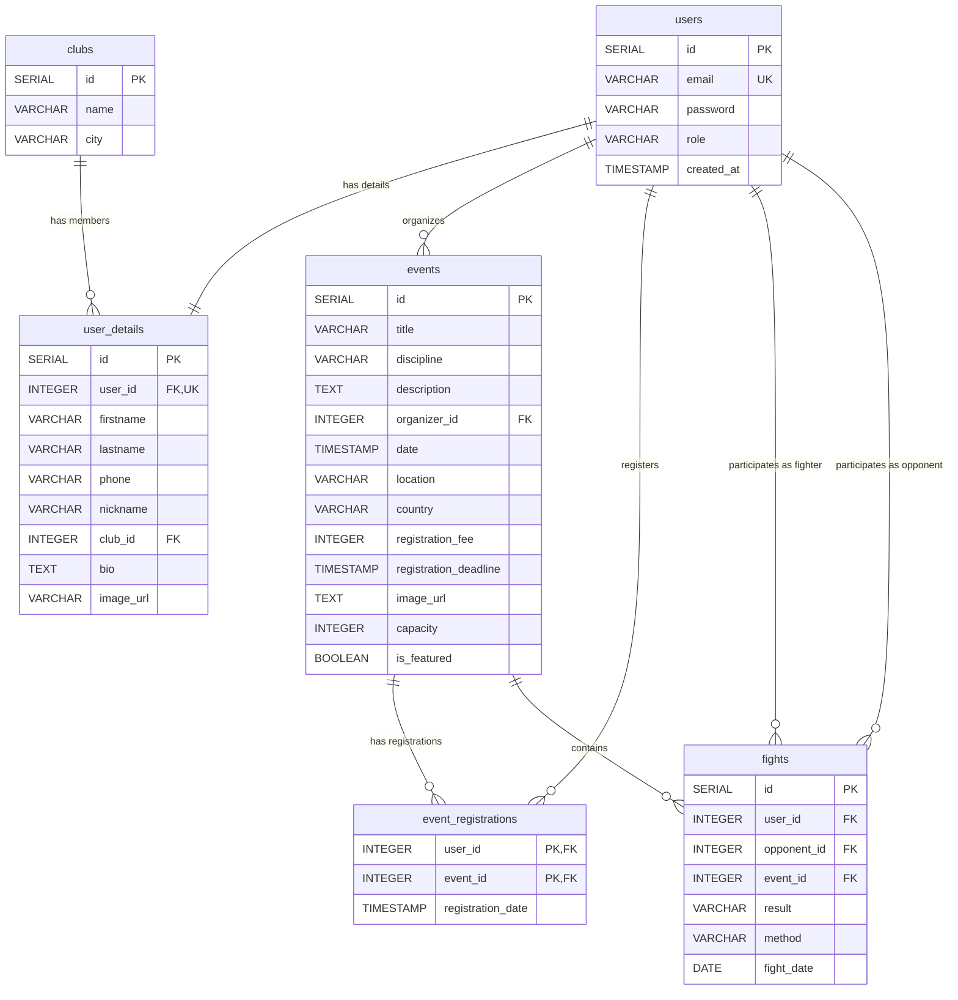

### Database Features

#### 🔗 Relation Types
- **One-to-One**: `users` ↔ `user_details` (each user has exactly one profile)
- **One-to-Many**: 
  - `clubs` → `user_details` (one club has many fighters)
  - `users` → `events` (one organizer creates many events)
- **Many-to-Many**: 
  - `users` ↔ `events` (via `event_registrations` - users can register for multiple events)
  - `users` ↔ `users` (via `fights` - fighters compete against each other)

#### 🗄️ Advanced Database Objects
- **Views** (4):
  - `v_user_fights` - Detailed fight history with JOIN on events and user_details
  - `v_athlete_records` - Automatic win/loss/draw counting per discipline using **aggregate functions**
  - `v_rankings` - Global athlete rankings with point calculation formula (Wins × 3 + Draws × 1)
  - `v_club_rankings` - Team-based rankings aggregating athlete performance per club
- **Triggers** (1): `tr_after_fight_insert` - Automatically creates mirror fight record for opponent
- **Functions** (1): `add_mirror_fight()` - Implements bidirectional fight record logic with **conditional logic**
- **Transactions**: ACID-compliant operations ensuring data consistency:
  - User registration (atomic INSERT into users + user_details)
  - Event registration (capacity validation with row-level locking `FOR UPDATE` + automatic rollback)
- **Complex JOINs**: Multi-table queries joining users, user_details, events, fights, clubs

#### ✅ Normalization & Data Integrity
- **3rd Normal Form (3NF)** - No redundancy (fight statistics calculated via views, not stored)
- **Foreign Key Constraints** - Referential integrity enforced on all relations
- **CASCADE Actions** - `ON DELETE CASCADE` for user_details, fights, event_registrations
- **CHECK Constraints**: 
  - Fight result validation (`WIN`, `LOSS`, `DRAW`)
  - Fight method validation (KO/TKO, Submission, Decision types, etc.)
  - Self-referencing check (user_id ≠ opponent_id in fights)
- **UNIQUE Constraints** - Email uniqueness, user_id uniqueness in user_details
- **Proper Data Types** - SERIAL for IDs, TIMESTAMP for dates, VARCHAR with appropriate lengths

---

## 🎬 Screenshots

### 🏠 Homepage - Featured Event
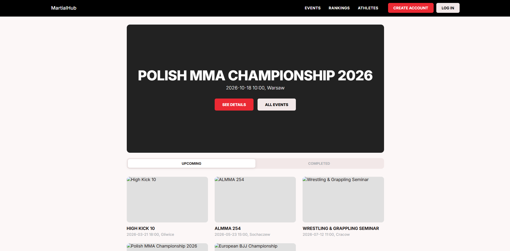
*Landing page showcasing the featured event with quick navigation*

### 🔐 Authentication

#### Login
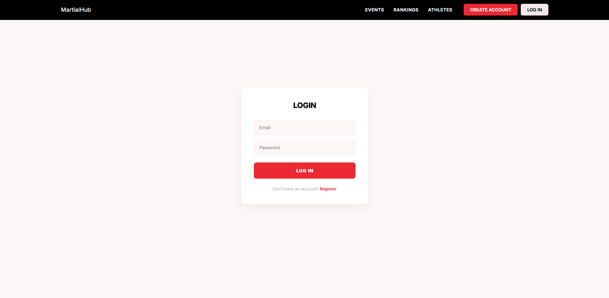
*Secure login with CSRF protection and session management*

#### Registration
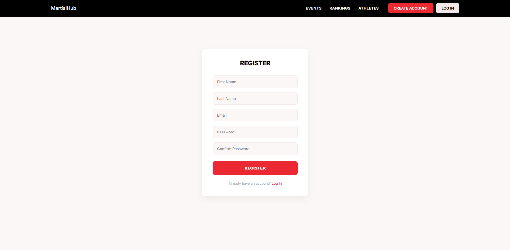
*User registration with validation and password confirmation*

### 🎪 Events Management

#### Events Dashboard
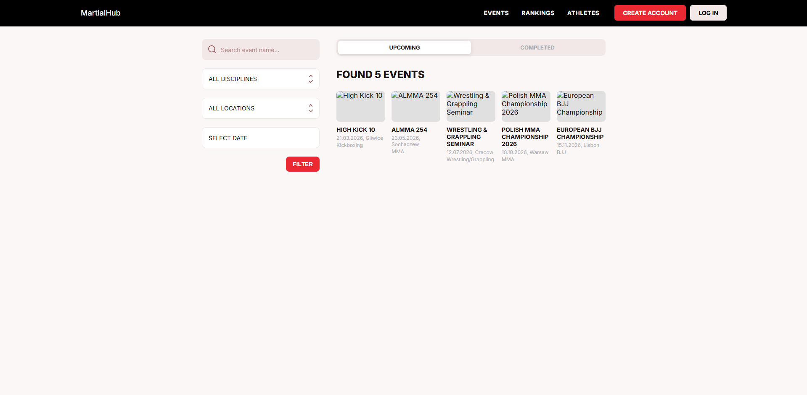
*Browse and filter martial arts events by discipline, location and date*

#### Event Details
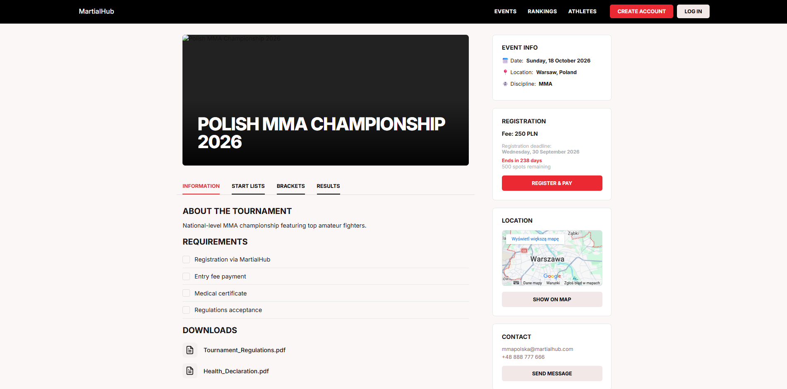
*Detailed view with registration options, participants and fight cards*

### 👤 User Profile & Statistics
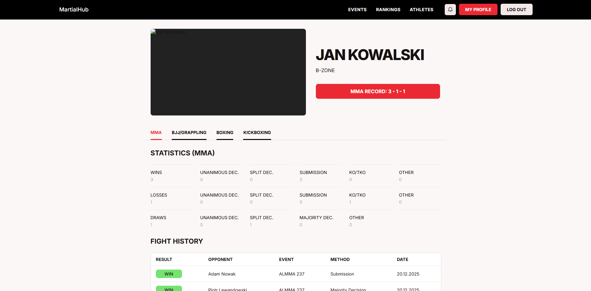
*Fighter statistics, fight history and club affiliation*

### 📊 Rankings System

#### Athlete Rankings
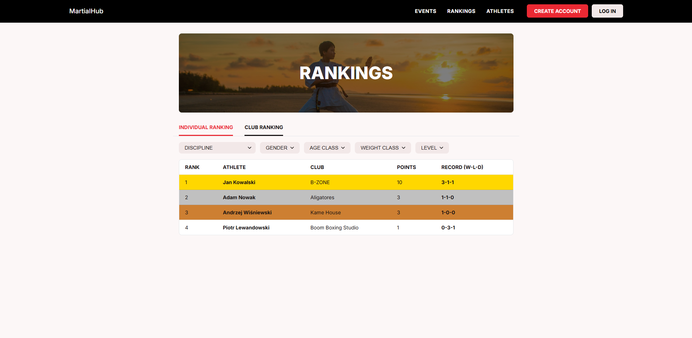
*Individual fighter rankings calculated from fight results (Win = 3pts, Draw = 1pt)*

#### Club Rankings
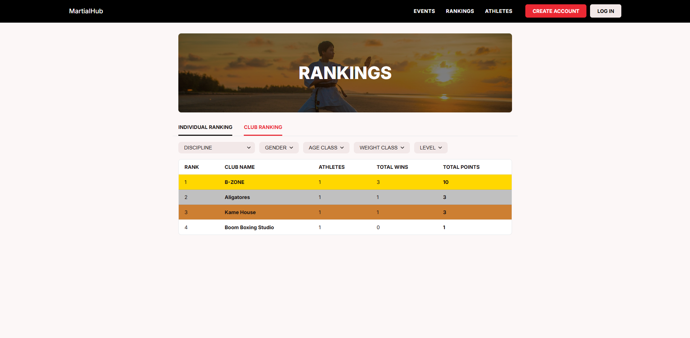
*Team-based leaderboards aggregating club performance*

### 👨‍💼 Admin Panel
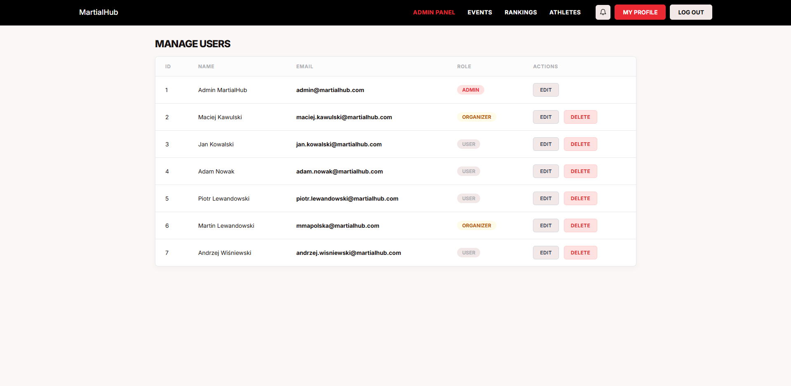
*User management dashboard with role assignment and CRUD operations*

### 📱 Responsive Design

#### Mobile View

<div align="center">

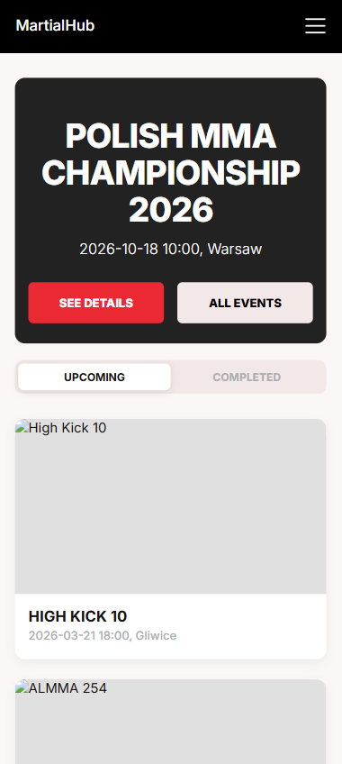

**Mobile-optimized main page with featured event**

---

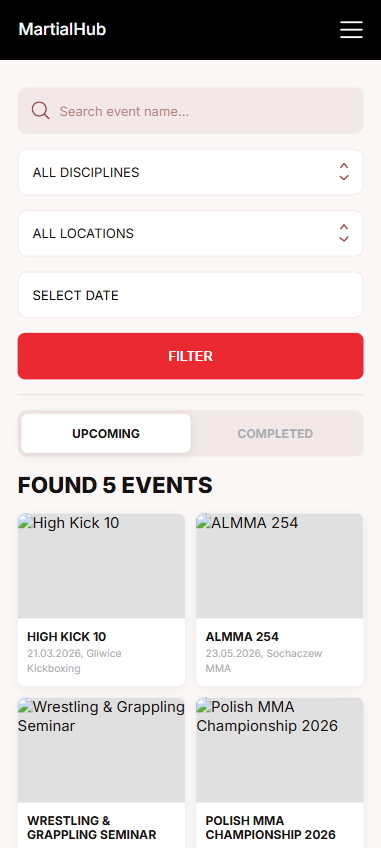

**Mobile-optimized event browsing with touch-friendly interface**

---

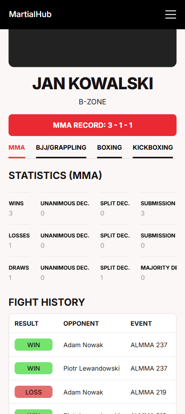

**Responsive profile page adapting to smaller screens**

</div>

### ⚠️ Custom Error Pages

#### 400 Bad Request
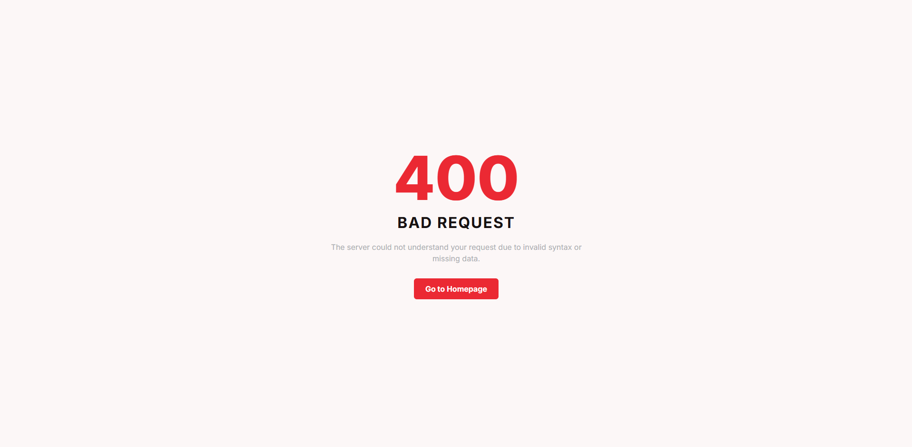
*Custom error page for invalid requests*

#### 403 Forbidden
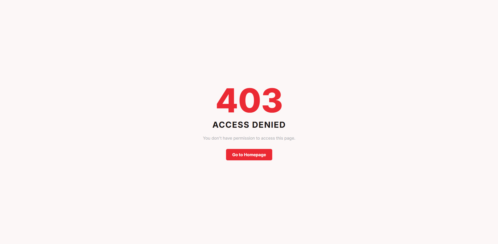
*Access denied page for unauthorized access attempts*

#### 404 Not Found
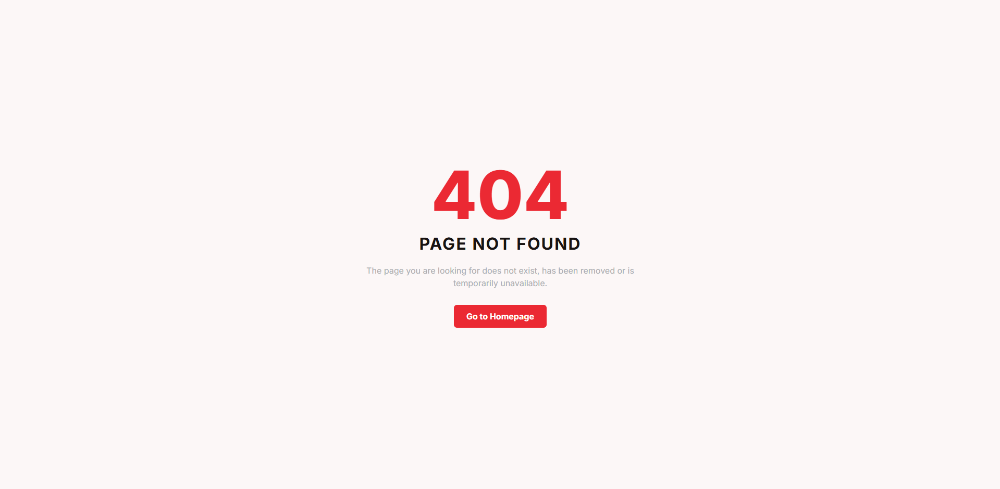
*Page not found with navigation back to homepage*

#### 500 Internal Server Error
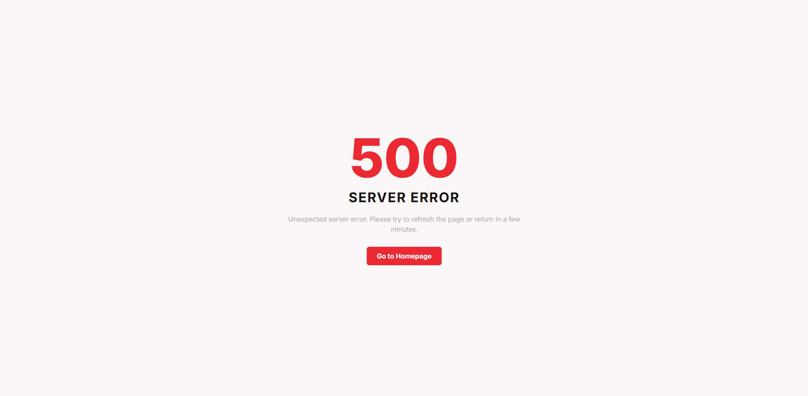
*Server error page with user-friendly message*

### 🎨 Design Documentation

Initial Figma mockups and wireframes created before development are available here:
📄 [Figma Mockups PDF](docs/design/martialhub-ui-mockups.pdf)

*The design document showcases the original UI/UX concepts, wireframes and visual design that guided the application development process.*

---

## 🚀 Getting Started

### Prerequisites

Before you begin, ensure you have the following installed:
- **Docker Engine** 20.10+
- **Docker Compose** 2.0+
- **Git** (for cloning the repository)

### Installation

1. **Clone the repository**
   ```bash
   git clone https://github.com/psarnecki/MartialHub.git
   cd MartialHub
   ```

2. **Set up environment configuration**
   ```bash
   cp config.php.example config.php
   cp .env.example .env
   ```
   
   Edit `config.php` and `.env` with your preferred settings (or use defaults)

3. **Launch with Docker Compose**
   ```bash
   docker-compose up -d --build
   ```
   
   This will:
   - Build all container images
   - Set up PostgreSQL database with schema
   - Install PHP dependencies via Composer
   - Start Nginx web server
   - Initialize pgAdmin for database management

4. **Access the application**
   - **Application**: [http://localhost:8080](http://localhost:8080)
   - **pgAdmin**: [http://localhost:5050](http://localhost:5050)
     - Default Email: `admin@martialhub.com`
     - Default Password: `admin`

5. **Create your first account**
   - Navigate to `/register`
   - Create an account (default role: 'user')
   - Admin can change roles via `/admin` panel or directly in database

---

## ⚙️ Environment Variables

The application uses environment variables defined in `.env` file (create from `.env.example`):

```bash
# Application
APP_PORT=8080                   # Port for web application

# Database
DB_HOST=db                      # Database host (Docker service name)
DB_PORT=5433                    # PostgreSQL port
DB_NAME=db                      # Database name
DB_USER=docker                  # Database user
DB_PASSWORD=docker              # Database password

# Demo/Seed Mode
SEED_DATA=true                  # Seed initial data (true/false)

# pgAdmin
PGADMIN_DEFAULT_EMAIL=admin@martialhub.com
PGADMIN_DEFAULT_PASSWORD=admin
PGADMIN_PORT=5050               # pgAdmin web interface port
```

**config.php** (Database connection settings):
```php
<?php
// Database configuration - reads from environment variables with fallback defaults
define('USERNAME', getenv('DB_USER') ?: 'docker');
define('PASSWORD', getenv('DB_PASSWORD') ?: 'docker');
define('HOST', getenv('DB_HOST') ?: 'db');
define('DATABASE', getenv('DB_NAME') ?: 'db');
```

> [!TIP]
> You can modify these default values or use environment variables to override them. For Docker deployment, the defaults work out of the box.

**Seed Data** (optional):
- Set `SEED_DATA=true` in `.env` to populate database with sample data:
  - Sample users (admin, organizers, fighters)
  - Clubs (Boom Boxing Studio, Aligatores, B-ZONE, etc.)
  - Events (Polish MMA Championship, BJJ tournaments, K1 fights)
  - Fight records with realistic results

---

### 🎭 Demo Accounts (Seeded Data)

The database comes pre-populated with sample users, events and fight history. You can use the following credentials to explore different roles and features:

| Role | Email | Password | Description |
|------|-------|----------|-------------|
| **Admin** | `admin@martialhub.com` | `admin` | Full system access, user management, role assignment |
| **Organizer** | `maciej.kawulski@martialhub.com` | `organizer` | Event organizer |
| **Organizer** | `mmapolska@martialhub.com` | `organizer` | Alternative organizer account (MMA Poland) |
| **Fighter** | `jan.kowalski@martialhub.com` | `user` | K1 fighter from B-ZONE club |
| **Fighter** | `adam.nowak@martialhub.com` | `user` | BJJ Blue Belt from Aligatores club |
| **Fighter** | `piotr.lewandowski@martialhub.com` | `user` | Boxing enthusiast from Boom Boxing Studio |
| **Fighter** | `andrzej.wisniewski@martialhub.com` | `user` | BJJ Black Belt from Kame House |

> [!NOTE]
> **Security Note**: Demo passwords are kept simple for testing purposes. However, the system enforces secure password hashing using bcrypt for all new registrations and the production-ready architecture supports complex validation rules.

---

## ✅ Testing

### Unit Tests (PHPUnit)

Run comprehensive unit tests for repositories and services:

```bash
docker exec -w /app martialhub-php-1 ./vendor/bin/phpunit --colors=always
```

**Expected Output:**
```
PHPUnit 10.5.63 by Sebastian Bergmann and contributors.

Runtime:       PHP 8.3.18RC1
Configuration: /app/phpunit.xml

.........                                                           9 / 9 (100%)

Time: 00:00.455, Memory: 8.00 MB

OK (9 tests, 28 assertions)
```

### Integration Tests

#### Windows (PowerShell)

Run from host machine:
```powershell
powershell -NoProfile -ExecutionPolicy Bypass -File .\tests\integration\integration_test.ps1
```

Or run inside Docker container:
```powershell
docker exec martialhub-php-1 sh /app/tests/integration/integration_test.sh
```

#### Mac/Linux (Bash)

Run from host machine (set `BASE_URL` environment variable):
```bash
BASE_URL=http://localhost:8080 sh tests/integration/integration_test.sh
```

Or run inside Docker container (uses internal network):
```bash
docker exec martialhub-php-1 sh /app/tests/integration/integration_test.sh
```

> [!TIP]
> **Running from host vs Docker container**: When running tests from your host machine (Windows/Mac/Linux), use `BASE_URL=http://localhost:8080`. When running inside the Docker container, the script automatically uses the internal Docker network URL (`http://martialhub-web-1:80`). You can modify the `BASE_URL` variable at the beginning of `integration_test.sh` and `integration_test.ps1` if needed.

**Expected Output:**
```
=========================================
MartialHub Integration Tests
=========================================

Test 1: GET /login (should return 200)... PASSED
Test 2: GET /register (should return 200)... PASSED
Test 3: GET /events (should return 200)... PASSED
Test 4: GET /rankings (should return 200)... PASSED
Test 5: GET /profile without auth (should redirect/403)... PASSED
Test 6: GET /nonexistent (should return 404)... PASSED
Test 7: POST /register without CSRF (should return 403)... PASSED
Test 8: GET /adminUsers without auth (should return 403)... PASSED

=========================================
Test Summary
=========================================
Passed: 8
Failed: 0

All tests passed!
```

---

## 📋 Test Scenarios

### Scenario 1: User Authentication and Authorization

**Step 1: Registration**
1. Navigate to `http://localhost:8080/register`
2. Fill in the form: First Name, Last Name, Email, Password, Confirm Password
3. Submit the form
4. Expected: Redirect to login page with success message

**Step 2: Login**
1. Navigate to `http://localhost:8080/login`
2. Enter credentials
3. Submit the form
4. Expected: Redirect to homepage page, session created

**Step 3: Session Verification**
1. Try accessing `/profile` while logged in
2. Expected: Profile page loads successfully
3. Logout and try accessing `/profile` again
4. Expected: Redirect to login page

### Scenario 2: Role-Based Access Control (RBAC)

**Test Admin Role:**
1. Login as admin user (`admin@martialhub.com` / `admin`)
2. Navigate to `/adminUsers` (Admin Panel)
3. Expected: Admin dashboard loads with user list
4. Verify: Can view all users, change roles, delete users

**Test Organizer Role:**
1. Login as organizer (`maciej.kawulski@martialhub.com` / `organizer`)
2. Navigate to `/events`
3. Expected: Events page loads successfully with filtering options
4. Try accessing `/adminUsers`
5. Expected: 403 Forbidden (organizers cannot access admin panel)

**Test User Role:**
1. Login as regular user (`jan.kowalski@martialhub.com` / `user`)
2. Try to access `/adminUsers`
3. Expected: 403 Forbidden page displayed
4. Navigate to `/events` 
5. Expected: Events page loads with filtering and browsing capabilities
6. Navigate to any event details page
7. Expected: Can view event details and register if spots available

### Scenario 3: CRUD Operations (Users - Admin Panel)

**Create:**
1. Users are created via public registration at `/register`
2. Fill in form: First Name, Last Name, Email, Password, Password Confirmation
3. Submit
4. Expected: User account created with default 'user' role
5. Admin can later change role via edit function

**Read:**
1. Login as admin (`admin@martialhub.com` / `admin`)
2. Navigate to `/adminUsers`
3. Expected: Admin panel loads showing all users with:
   - User ID, First Name, Last Name, Email
   - Role (user/organizer/admin)
   - Edit and Delete buttons for each user

**Update:**
1. As admin, navigate to `/adminUsers`
2. Click "Edit" button next to any user
3. Modify user data: First Name, Last Name or Role
4. Submit
5. Expected: User updated, redirected back to admin panel with changes visible

**Delete:**
1. As admin, navigate to `/adminUsers`
2. Find your own account: Expected: The "Delete" button is hidden/disabled for the currently logged-in admin to prevent accidental self-deletion
3. Find another user and click the "Delete" button
4. Confirm deletion in popup
5. Expected: User removed from database via AJAX, row disappears from table without page reload

### Scenario 4: Event Registration & Viewing

**Browse Events:**
1. Navigate to `/events`
2. Expected: Events page loads with all upcoming events
3. Use filters: Search by name, select discipline (MMA/K1/BJJ/etc.), location or date
4. Click "FILTER" button
5. Expected: Events list updates dynamically via AJAX without page reload

**View Event Details:**
1. Click on any event card
2. Expected: Event details page loads showing:
   - Event title, image and description
   - Date, location, country, discipline
   - Registration fee and deadline
   - Days remaining until registration closes
   - Available spots (capacity - current registrations)
   - Active registration button (if logged in and spots available)

**Register for Event:**
1. Login as user
2. Navigate to event details page with available spots
3. Click "REGISTER" button
4. Expected: Registration processed via AJAX
5. Button changes to "REGISTERED" and becomes disabled
6. Spots counter decreases by 1

**Registration Capacity Test:**
1. Create an event with only 1 spot left
2. Register as first user - Expected: Success
3. Try to register as second user - Expected: "Event is full" error message
4. Verify: Database transaction prevents over-registration

**Filter Functionality:**
1. On `/events` page, test each filter:
   - Search: Type event name (e.g., "Polish MMA")
   - Discipline: Select "K1" - only K1 events shown
   - Location: Select "Warsaw" - only Warsaw events shown
   - Date: Pick specific date - events on/after that date shown
2. Combine multiple filters
3. Expected: Real-time filtering via Fetch API

### Scenario 5: Database Features Testing
1. Navigate to `/rankings`
2. Select discipline (e.g., "MMA")
3. Expected: Data loaded from view `v_rankings` showing:
   - Fighter names
   - Club affiliations
   - Win/Loss/Draw records
   - Calculated points (Wins × 3 + Draws × 1)
4. Switch to "Club Rankings"
5. Expected: Data from `v_club_rankings` aggregating club performance

**Triggers:**
1. Add a new fight result for a specific user (via direct DB insert)
2. Expected: Trigger `tr_after_fight_insert` automatically creates mirror fight record
3. As result both fighters have the fight in their history with logically opposite results (e.g., Winner gets "WIN", Opponent gets "LOSS")

**Functions:**
1. Check fight history view on profile page
2. Expected: Data retrieved from `v_user_fights` showing:
   - Opponent names (JOIN with user_details)
   - Event names (JOIN with events)
   - Fight results and methods
3. Verify complex JOIN operations returning consolidated data

**Transactions:**
1. Attempt to register for an event at full capacity
2. Expected: Transaction rollback if capacity exceeded
3. Verify data consistency: registration count never exceeds event capacity

### Scenario 6: Error Handling

**400 Bad Request:**
1. Submit login form with empty fields
2. Expected: 400 error or validation message

**401 Unauthorized:**
1. Access `/profile` without logging in
2. Expected: Redirect to login

**403 Forbidden:**
1. Login as regular user
2. Try to access `/adminUsers`
3. Expected: Custom 403 Forbidden page

**404 Not Found:**
1. Navigate to `/nonexistent-page`
2. Expected: Custom 404 error page

**500 Internal Server Error:**
1. Simulate database connection failure
2. Expected: Custom 500 error page (not raw PHP error)

### Scenario 7: CSRF Protection

**Test CSRF Token:**
1. Open login page
2. Inspect form, verify CSRF token field present
3. Submit form with invalid/missing token
4. Expected: Request rejected (403 Forbidden)

---

## Project Structure

```
MartialHub/
├── config.php              # Database configuration
├── index.php               # Application entry point
├── Routing.php             # Route definitions
├── Database.php            # Database connection handler
├── composer.json           # PHP dependencies
├── phpunit.xml             # PHPUnit configuration
├── docker-compose.yaml     # Docker services configuration
│
├── docker/                 # Docker configuration
│   ├── db/                 # PostgreSQL setup
│   ├── nginx/              # Nginx web server
│   └── php/                # PHP-FPM container
│
├── src/
│   ├── controllers/        # MVC Controllers
│   │   ├── AppController.php
│   │   ├── SecurityController.php
│   │   ├── EventController.php
│   │   ├── ProfileController.php
│   │   ├── RankingController.php
│   │   └── AdminController.php
│   │
│   ├── models/             # Data models
│   │   ├── User.php
│   │   └── Event.php
│   │
│   ├── repository/         # Database repositories
│   │   ├── Repository.php
│   │   ├── UserRepository.php
│   │   ├── EventRepository.php
│   │   ├── ProfileRepository.php
│   │   └── RankingRepository.php
│   │
│   └── viewmodels/         # View models for templates
│       ├── EventViewModel.php
│       └── ProfileViewModel.php
│
├── public/
│   ├── views/              # HTML templates
│   │   ├── partials/       # Reusable components (navbar, etc.)
│   │   ├── login.html
│   │   ├── register.html
│   │   ├── events.html
│   │   ├── profile.html
│   │   └── ...
│   │
│   ├── scripts/            # JavaScript files
│   │   ├── main.js
│   │   ├── events.js
│   │   ├── profile.js
│   │   └── admin.js
│   │
│   └── styles/             # CSS stylesheets
│       ├── main.css
│       ├── auth.css
│       ├── events.css
│       └── ...
│
└── tests/
    ├── bootstrap.php       # PHPUnit bootstrap
    ├── unit/               # Unit tests
    │   └── UserRepositoryTest.php
    └── integration/        # Integration tests
        ├── integration_test.sh   # Bash script (Container/Mac/Linux)
        └── integration_test.ps1  # PowerShell script (Windows)
```

---

## 💡 Implementation Checklist

### ✅ Core Requirements

- [x] **Docker** - Full containerization (PHP, Nginx, PostgreSQL, pgAdmin)
- [x] **Git** - Version control with systematic commits
- [x] **HTML5** - Semantic markup
- [x] **CSS3** - Custom styles, no frameworks
- [x] **JavaScript** - Vanilla JS with Fetch API
- [x] **PHP OOP** - Object-oriented, SOLID principles
- [x] **PostgreSQL** - Relational database

### ✅ Architecture

- [x] **MVC Pattern** - Model-View-Controller architecture
- [x] **Repository Pattern** - Data access abstraction
- [x] **Front Controller** - Single entry point (index.php)
- [x] **Separation of Concerns** - Clear layer separation

### ✅ Design & UX

- [x] **Responsive Design** - CSS Media Queries
- [x] **Modern UI** - Clean, professional interface
- [x] **Accessibility** - Semantic HTML, proper forms
- [x] **Error Pages** - Custom 400, 403, 404, 500 pages

### ✅ Authentication & Authorization

- [x] **User Registration** - With validation
- [x] **Login/Logout** - Session management
- [x] **Role System** - User, Organizer, Admin
- [x] **Permission Checks** - Runtime verification
- [x] **CSRF Protection** - Token-based validation

### ✅ Database Features

- [x] **Relations**:
  - [x] One-to-One (`users` ↔ `user_details`)
  - [x] One-to-Many (`clubs` → `user_details`, `users` → `events`)
  - [x] Many-to-Many (`users` ↔ `events` via `event_registrations`, `users` ↔ `users` via `fights`)
  
- [x] **Database Objects**:
  - [x] 4 Views:
    - `v_user_fights` - Fight history with JOIN
    - `v_athlete_records` - Win/Loss/Draw aggregation
    - `v_rankings` - Athlete rankings with point calculation
    - `v_club_rankings` - Team-based rankings
  - [x] 1 Trigger (`tr_after_fight_insert` - auto-creates mirror fight record)
  - [x] 1 Function (`add_mirror_fight()` - bidirectional fight logic)
  - [x] Transactions (All CRUD operations with proper isolation)
  - [x] JOIN Queries (Multi-table: users, user_details, events, fights, clubs)

- [x] **Normalization**:
  - [x] 3rd Normal Form (3NF)
  - [x] No redundancy (stats calculated via views, not stored)
  - [x] No anomalies
  - [x] Proper data types

- [x] **Constraints**:
  - [x] Foreign Keys with CASCADE
  - [x] CHECK constraints (fight result/method validation, self-reference prevention)
  - [x] UNIQUE constraints (email, user_id in user_details)

### ✅ Testing

- [x] **PHPUnit** - Unit tests for repositories
- [x] **Integration Tests** - Bash/PowerShell scripts
- [x] **Test Coverage** - Core functionality tested
- [x] **CI/CD Ready** - Docker-based testing

### ✅ Code Quality

- [x] **OOP Principles** - Encapsulation, inheritance, polymorphism
- [x] **SOLID Principles** applied where appropriate for project scope:
  - [x] Single Responsibility - Each class has one clear purpose
  - [x] Open/Closed - Repository pattern allows extension
  - [x] Liskov Substitution - Child controllers extend AppController properly
  - [ ] Interface Segregation - No interfaces used in current implementation
  - [x] Dependency Inversion - Controllers depend on repositories (abstraction)
- [x] **DRY** - No code duplication
- [x] **Clean Code** - Readable, maintainable

### ✅ Documentation

- [x] **README.md** - Complete documentation
- [x] **ERD Diagram** - Database schema visualization
- [x] **Architecture Diagram** - System overview
- [x] **Screenshots** - UI demonstration
- [x] **Setup Instructions** - Docker Compose
- [x] **Test Scenarios** - Step-by-step guides
- [x] **Environment Variables** - .env.example

### ✅ Additional Features

- [x] **Admin Panel** - User management with role assignment (CRUD on users)
- [x] **Event Browsing** - View and filter events (READ only, no CREATE/UPDATE/DELETE in app)
- [x] **Event Registration** - Capacity-limited user registration system with transaction safety
- [x] **Profile System** - User profiles with club affiliation and fight history
- [x] **Ranking System** - Athlete and club rankings by discipline (using database views)
- [x] **Fight History** - Complete fight records with results tracking (on profile page)
- [x] **Search & Filter** - Event filtering by discipline, location, date, search term (AJAX)
- [x] **Featured Events** - Single highlighted event on homepage
- [x] **Club Display** - Shows club affiliations (READ only)

### 📋 Project Statistics

- **Total Commits**: 70+ (systematic development)
- **Lines of Code**: ~3000+ (PHP backend + HTML/CSS/JS frontend)
- **Test Coverage**: 
  - Unit Tests: 9 tests (UserRepository), 28 assertions
  - Integration Tests: 8 endpoint tests
- **Database Tables**: 6 (users, user_details, clubs, events, event_registrations, fights)
- **Database Views**: 4 (v_user_fights, v_athlete_records, v_rankings, v_club_rankings)
- **API Endpoints**: 15+ routes
- **User Roles**: 3 (User, Organizer, Admin)
- **Dynamic Disciplines**: Automatically supports any new discipline added via event creation (tested with MMA, K1, BJJ, etc.)

> [!NOTE]
> **Event & Club Management**: Events, clubs and fights are currently populated via database seeding or direct database manipulation. The application focuses on user registration, event browsing/registration, rankings display and user CRUD (admin panel).

---

## 🔒 PHP SECURITY BINGO CHECKLIST

### ✅ SQL Injection Prevention
- [x] **Prepared Statements** - All database queries use PDO prepared statements
- [x] **No SQL Concatenation** - Zero string concatenation in SQL queries
- [x] **Parameterized Queries** - All user input sanitized via PDO placeholders

### ✅ Authentication & Password Security
- [x] **Secure Password Hashing** - Bcrypt via `password_hash()` (never plain text)
- [x] **Password Complexity Validation** - Minimum length requirements enforced
- [x] **No Password Exposure** - Passwords never logged, dumped or passed to views
- [x] **Email Enumeration Protection** - Generic error message: "Email or password incorrect" (doesn't reveal if email exists)
- [x] **Email Format Validation** - Server-side email format validation
- [x] **Duplicate Email Prevention** - Registration checks if email already exists in database

### ✅ Session Management
- [x] **Session Regeneration** - Session ID regenerated after successful login
- [x] **HttpOnly Cookie Flag** - Session cookie inaccessible to JavaScript
- [x] **SameSite Cookie Attribute** - SameSite=Lax/Strict configured
- [x] **Proper Logout** - Session destroyed on logout
- [x] **Singleton Repository** - UserRepository managed as singleton pattern

### ✅ CSRF Protection
- [x] **CSRF Token in Login Form** - Token validated on login POST
- [x] **CSRF Token in Registration Form** - Token validated on registration POST
- [x] **CSRF Token on All State-Changing Operations** - All POST/PUT/DELETE requests protected

### ✅ Input Validation & Sanitization
- [x] **Input Length Limits** - Email, password, name fields have maximum length constraints
- [x] **Server-Side Validation** - All input validated on server (not just client-side)
- [x] **XSS Protection** - All output escaped in views (htmlspecialchars and helper escapehtml method in js files)

### ✅ HTTP & Routing Security
- [x] **HTTP Method Separation** - Login/Register accept POST for actions, GET only renders views
- [x] **Proper HTTP Status Codes** - 400/401/403/404/500 returned appropriately
- [x] **No Stack Trace Exposure** - Production mode shows custom error pages (not raw PHP errors)

### ✅ Data Minimization & Privacy
- [x] **Minimal User Data Fetching** - Only necessary user fields retrieved from database
- [x] **No Sensitive Data in Views** - Passwords never passed to templates

### ✅ Logging & Audit
- [x] **Failed Login Logging** - Unsuccessful login attempts logged (without passwords) for audit

### ❌ Not Implemented (Production Enhancements)
- [ ] **HTTPS Enforcement** - Login and registration not enforced over HTTPS only
- [ ] **Secure Cookie Flag** - Cookie Secure flag not set (requires HTTPS)
- [ ] **Rate Limiting** - No login attempt throttling/temporary lockout/CAPTCHA after multiple failures

> [!TIP]
> **Security Score**: 22/25 implemented (88%) - All critical security measures in place. Missing features require HTTPS infrastructure and rate limiting middleware, suitable for production deployment.

---

## 📄 License

This project is developed for **educational purposes** as part of university coursework in Web Applications course.

---

## 👨‍💻 Author

**Piotr Sarnecki**

---

<div align="center">
  <p>
    <a href="#-about-the-project">Back to Top ↑</a>
  </p>
</div>